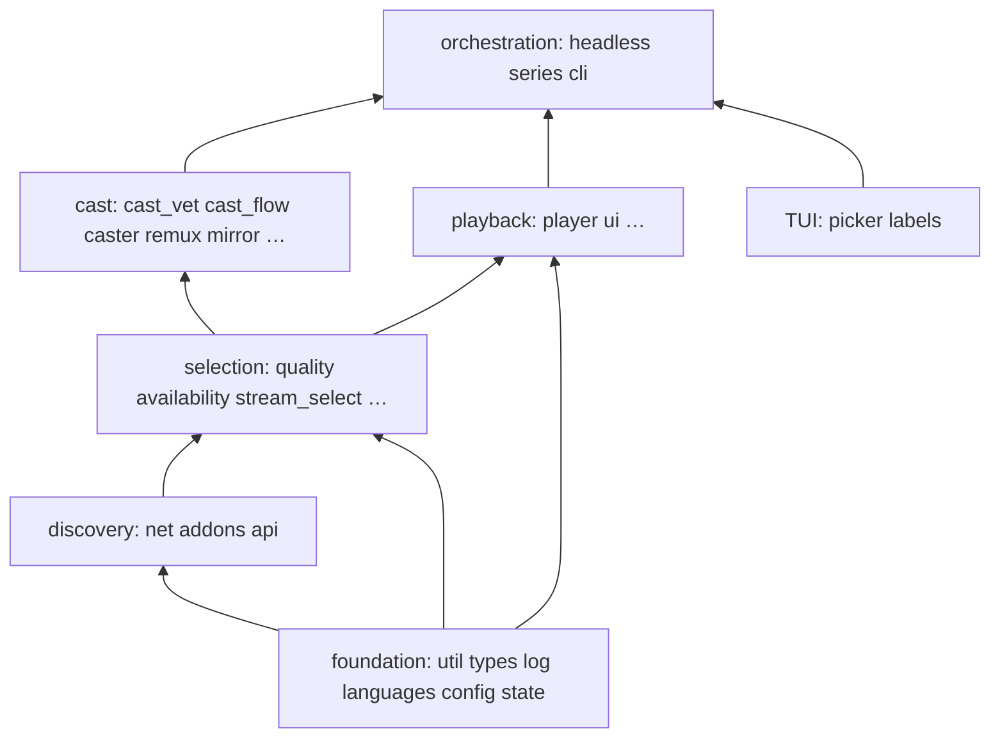

# Architecture — module map

Single source of truth for **where code lives**. Decision *why* → [`docs/adr/`](adr/README.md).
Stream ranking *how* → [`selection.md`](selection.md). Headless contract → [`headless.md`](headless.md).
Agent commands & constraints → [`CLAUDE.md`](../CLAUDE.md). Docs hub → [`README.md`](README.md).

**Layout:** mostly flat `src/nstream/*.py` (stdlib-only runtime). `state/` is a small package
because it owns independent stores. Domains below are logical clusters (not import packages).

```
src/nstream/
├── orchestration    cli · cli_args · headless · headless_play · application · series · settings · doctor
├── selection        stream_select · availability · quality · tracks · sources · debrid · engine
├── cast             cast_flow · cast_vet · cast_delivery · cast_control · caster
│                    · remux · live · mirror · bridge · serve · urlproxy · discovery
│                    · (_catt_load: catt.api helper on catt's interpreter)
├── subs             subs · subalign · srt · oshash · (_bench · _subalign_remote dev-only)
├── playback         playback · player · labels · picker · preview · ui · explain
├── discovery/API    api · addons · net
└── foundation       config · types · state/ · log · util · languages · providers · notices
```

Also: `__main__.py` (module entry), `nstream.lua` (mpv next-episode overlay).

## Import-graph discipline

- **Top (few/no internal imports):** `util`, `ui`, `languages`, `types`, `sources`, `net`, `log`
  — pure helpers and registries. `labels` sits near the top (display only).
- **Bottom (orchestrator):** `cli` — everything else **never** imports `cli`
- One-way chain (no cycles): `headless` → `headless_play` → `cast_flow` → `cast_vet` →
  `stream_select`
- **Domain never prompts (ADR 0037):** whether a run may ask is `PlayOpts.interactive`, set by
  the frontend (TUI True, `--json` False) — never a TTY probe. Prompts are injected:
  `PlayOpts.confirm` (yes/no), `PlayOpts.choose` (single choice), `PlayOpts.choose_stream`
  (renders a `stream_select.StreamMenu`), `caster.resolve_device(confirm=, picker=)`,
  `caster.cast(choose_lang=)`. Domain modules never import `picker`/`labels`
  (`tests/test_architecture.py`, no exceptions left)
- Machine output: every `--json` object goes through `log.emit_json` (scrubbed); domain
  notices go through `notices.emit` (stderr unchanged) and ride along as `notices` (ADR 0037)
- Menus: `menus` (frontend tier) holds the TUI menus over domain data — `choose_tracks`,
  `choose_stream`
- Failures: `failures.describe` maps a domain exception to one `Failure(code, message, hint,
  fields)` for both the TUI notice and the `--json` error (orchestration tier, frontends only)
- Candidate pass shared by play, `--explain`, `--probe`: `stream_select.prepare_candidates`
- `cast_vet` → `stream_select` helpers (`playable_url`, `cast_playable`, `audio_languages`; public since 2026-10-01 — older ADRs cite them as `_playable_url` / `_cast_playable`)
- `availability` is a leaf under selection (probe + denylist); `stream_select` orchestrates targets
- Domain payloads: import from `nstream.types`, not `config`
- State: `from nstream import state` (package public API); stores live in `state.history` /
  `state.cast_session` / `state.dead` / `state.breaker`



## Domains

### Orchestration

| Module | Role |
|--------|------|
| `cli` | TUI flow + `main` dispatch (not argparse construction) |
| `cli_args` | `build_parser()` — flag surface for TUI and `--json` |
| `headless` | `--json` entry: title select, lifecycle (`--stop`/`--status`/…), delegates play |
| `headless_play` | One-title resolve → prepare_stream → play/cast → success JSON |
| `application` | Shared local subtitle/track preparation and verified playback for both frontends |
| `doctor` | Read-only installation/config diagnostics; no network or backend effects |
| `series` | series-only flow (ADR 0009) + continuation policy: `next_up` / `next_video` (ADR 0029) |
| `settings` | fzf settings menu |

### Selection & resolve

| Module | Role |
|--------|------|
| `stream_select` | `prepare_stream`: quality → rank/pick → resolve → primary-lang guard |
| `availability` | classified probes, dead-source denylist, drop unusable (ADR 0014/0025) |
| `quality` | parse release names + structured fields (ADR 0026), `HwCaps` (vainfo), rank/filter |
| `tracks` | ffprobe (memoized per url) |
| `sources` | stream-source presets (ADR 0024) |
| `debrid` / `engine` | native debrid resolve / TorrServer P2P (privacy gate ADR 0032) |

### Cast stack

```
cast_flow.run_cast                       ← decides `advance` (ADR 0029), once, for all backends
  → cast_vet (audio / video / container)  ← ADR 0017, 0022
  → mirror | remux (Tier-2) | caster      ← report (pos, dur, started); never `advance` (ADR 0031)
       → cast_delivery.drive_bridge → bridge
       → serve (Range HTTP for remux; ports 45000–47000)
  discovery: background catt scan + devices cache (ADR 0010)
```

| Module | Role |
|--------|------|
| `cast_flow` | Decision tree: vet → mirror gate → remux → direct |
| `cast_vet` | Audio plan, video codec, container |
| `cast_delivery` | Shared castbridge event loop (ADR 0011) |
| `cast_control` | TUI lifecycle: stop/status/pause/seek/volume + runtime health |
| `caster` | Device resolve; castbridge or catt LOAD (`catt_lib_play` / `_catt_load` / CLI `-l` + BUFFERED, ADR 0050) |
| `remux` / `serve` | Tier-2 file + Range server |
| `mirror` | Realtime 1080p path |
| `bridge` | castbridge IPC client + daemon ensure |
| `discovery` | Non-blocking Chromecast discovery |
| `urlproxy` | Loopback proxy: ffmpeg/ffprobe read a debrid url without it in their argv |
| `live` | Live HLS-TS producer for Tier-2 (ADR 0039): ffmpeg argv, playlist timeline, pruning behind the play head, pausing far ahead |

### Subs

| Module | Role |
|--------|------|
| `subs` | OpenSubtitles fetch/rank/download + pre-play `choose_tracks` |
| `subalign` | Local-file audio alignment engine (ADR 0020): `probe_local` + pure `align` |
| `srt` | SRT / WebVTT helpers |
| `oshash` | OpenSubtitles file hash |
| `_bench` | Dev-only alignment benchmarks (not shipped behaviour) |
| `_subalign_remote` | Dev-only sparse remote probing used by `_bench` (not shipped) |

### Playback / TUI

| Module | Role |
|--------|------|
| `player` | mpv launch, IPC position, hwdec/quiet/lang defaults |
| `playback` | Typed local playback outcome and media-evidence error contract |
| `labels` | fzf/mpv display strings |
| `picker` | Shared fzf helpers |
| `preview` | Poster + metadata card (`__preview`) |
| `ui` | Caps, palette, glyphs, layout (`ui.Caps` ≠ `quality.HwCaps`) |
| `explain` | `--explain` renderer |

### Discovery / API

| Module | Role |
|--------|------|
| `api` | Resource dispatch, gather budget, per-addon breaker (ADR 0027), fuse/dedup streams; `play_id` for catalog rows (ADR 0046); catalog-id → IMDb (`translate_id`, ADR 0047) |
| `addons` | Manifest client + cache; `extra_catalogs` / `catalog_fetch_type` for the board (ADR 0046); `trakt_catalogs` / `can_fetch_catalog` (ADR 0049) |
| `net` | Retrying HTTP JSON + URL probe classification |

The Film / Serie board (`cli.run_section`) lists unlocked-manifest catalogs via
`addons.extra_catalogs` under **── cataloghi addon ──** (not a marketplace). A user-configured
Trakt catalog addon (ADR 0049; `cfg.trakt_addon` / `NSTREAM_TRAKT_ADDON` / Fonti paste) lists
under **── Trakt ──** — catalogs only, not an indexer and not a sync of local history.
`api.catalog` fetches with `addons.catalog_fetch_type` (Trakt may omit the `catalog` resource).
`api.play_id` prefers a `tt` already on the row (`imdb_id` or `behaviorHints.defaultVideoId`)
so a `tmdb:` catalog id can still enter `api.streams` — not a translator (ADR 0046).

`net.AddonPool` bounds daemon workers and queued work. `api._gather` alone records
breaker outcomes; HTTP work inherits its monotonic deadline. `util.state_update`
serializes best-effort store updates with bounded locks and corrupt-file recovery.
`tests/test_architecture.py` enforces: stdlib-only runtime, nothing imports `cli`, no import
cycles, no domain→TUI edge, and a bottom tier (`util`, `log`, `notices`, `languages`, `srt`,
`providers`) that imports only itself. Other rules on this page are review-enforced.

### Foundation

| Module | Role |
|--------|------|
| `types` | `Meta`, `Video`, `Stream`, `Subtitle`, `HistoryEntry` |
| `config` | `Config`, `PlayOpts`, load/save, path helpers |
| `state/` | history + library (`resumable`, `is_watched`, watchlist/recent), cast session, dead-sources, breaker |
| `log` / `util` / `languages` | logging+redaction, atomic I/O + text folding, language tokens |
| `providers` | Debrid provider keys (leaf: `log` builds its redaction from them) |

**State files:** `history.json` (progress), `library.json` (recent queries + metadata-only
watchlist — no stream URLs), `dead-sources.json` (ADR 0025), `addon-breakers.json` (ADR 0027).
Paths via `config.*_path()` / `state.breaker`.

## Naming notes

- **`ui.Caps`** — terminal capabilities
- **`quality.HwCaps`** — GPU decode capabilities (vainfo)

## When adding a module

1. Place it where the *policy* lives (not the first caller).
2. Preserve import discipline (`cli` at the bottom).
3. Add `tests/test_<mod>.py` (or package tests).
4. Update **this file** only (not README architecture prose).
5. New architectural trade-off → ADR ([CONTRIBUTING.md](../CONTRIBUTING.md)).
