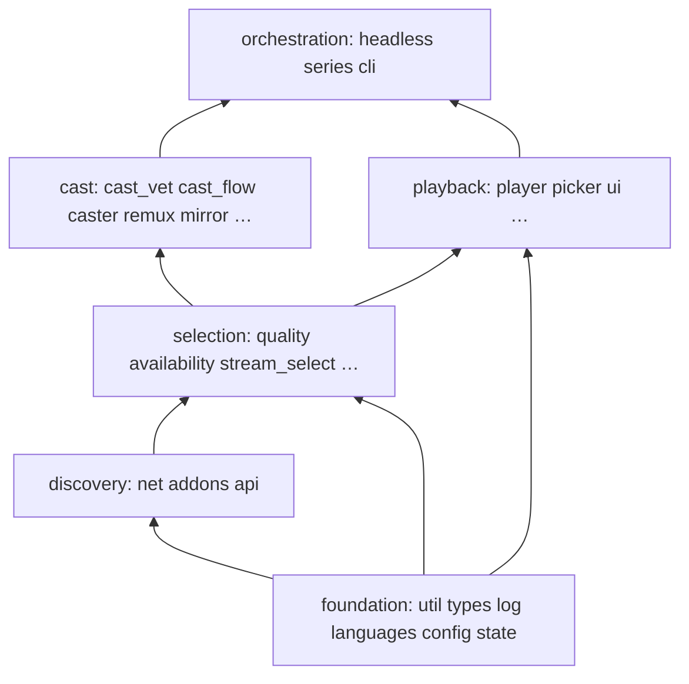

# Architecture — module map

Single source of truth for **where code lives**. Decision *why* → [`docs/adr/`](adr/README.md).
Stream ranking *how* → [`selection.md`](selection.md). Headless contract → [`headless.md`](headless.md).
Agent commands & constraints → [`CLAUDE.md`](../CLAUDE.md). Docs hub → [`README.md`](README.md).

**Layout:** mostly flat `src/nstream/*.py` (stdlib-only runtime). `state/` is a small package
because it owns independent stores. Domains below are logical clusters (not import packages).

```
src/nstream/
├── orchestration    cli · cli_args · headless · headless_play · series · settings
├── selection        stream_select · availability · quality · tracks · sources · debrid · engine
├── cast             cast_flow · cast_vet · cast_delivery · cast_control · caster
│                    · remux · mirror · bridge · serve · discovery
├── subs             subs · subalign · srt · oshash · (_bench dev-only)
├── playback         player · labels · picker · preview · ui · explain
├── discovery/API    api · addons · net
└── foundation       config · types · state/ · log · util · languages
```

Also: `__main__.py` (module entry), `nstream.lua` (mpv next-episode overlay).

## Import-graph discipline

- **Top (few/no internal imports):** `util`, `ui`, `languages`, `types`, `sources`, `net`, `log`
  — pure helpers and registries. `labels` sits near the top (display only).
- **Bottom (orchestrator):** `cli` — everything else **never** imports `cli`
- Same tier (no cycles): `headless` ↔ `headless_play` ↔ `cast_flow` ↔ `stream_select` / `cast_vet`
- `cast_vet` → `stream_select` helpers (`_playable_url`, `_cast_playable`, `audio_languages`)
- `availability` is a leaf under selection (probe + denylist); `stream_select` orchestrates targets
- Domain payloads: import from `nstream.types`, not `config`
- State: `from nstream import state` (package public API); stores live in `state.history` /
  `state.cast_session` / `state.dead` / `state.breaker`



## Domains

### Orchestration

| Module | Role |
|--------|------|
| `cli` | TUI flow + `main` dispatch (not argparse construction) |
| `cli_args` | `build_parser()` — flag surface for TUI and `--json` |
| `headless` | `--json` entry: title select, lifecycle (`--stop`/`--status`/…), delegates play |
| `headless_play` | One-title resolve → prepare_stream → play/cast → success JSON |
| `series` | series-only flow (ADR 0009) + continuation policy: `next_up` / `next_video` (ADR 0029) |
| `settings` | fzf settings menu |

### Selection & resolve

| Module | Role |
|--------|------|
| `stream_select` | `prepare_stream`: quality → rank/pick → resolve → primary-lang guard |
| `availability` | classified probes, dead-source denylist, drop unusable (ADR 0014/0025) |
| `quality` | parse release names + structured fields (ADR 0026), `HwCaps` (vainfo), rank/filter |
| `tracks` | ffprobe (memoized per url) |
| `sources` | stream-source presets (ADR 0024) |
| `debrid` / `engine` | native debrid resolve / TorrServer P2P (privacy gate ADR 0032) |

### Cast stack

```
cast_flow.run_cast                       ← decides `advance` (ADR 0029), once, for all backends
  → cast_vet (audio / video / container)  ← ADR 0017, 0022
  → mirror | remux (Tier-2) | caster      ← report (pos, dur, started); never `advance` (ADR 0031)
       → cast_delivery.drive_bridge → bridge
       → serve (Range HTTP for remux; ports 45000–47000)
  discovery: background catt scan + devices cache (ADR 0010)
```

| Module | Role |
|--------|------|
| `cast_flow` | Decision tree: vet → mirror gate → remux → direct |
| `cast_vet` | Audio plan, video codec, container |
| `cast_delivery` | Shared castbridge event loop (ADR 0011) |
| `cast_control` | TUI lifecycle: stop/status/volume + runtime health |
| `caster` | Device resolve; castbridge or catt LOAD |
| `remux` / `serve` | Tier-2 file + Range server |
| `mirror` | Realtime 1080p path |
| `bridge` | castbridge IPC client + daemon ensure |
| `discovery` | Non-blocking Chromecast discovery |

### Subs

| Module | Role |
|--------|------|
| `subs` | OpenSubtitles fetch/rank/download + pre-play `choose_tracks` |
| `subalign` | Native sparse-evidence alignment (ADR 0020) |
| `srt` | SRT / WebVTT helpers |
| `oshash` | OpenSubtitles file hash |
| `_bench` | Dev-only alignment benchmarks (not shipped behaviour) |

### Playback / TUI

| Module | Role |
|--------|------|
| `player` | mpv launch, IPC position, hwdec/quiet/lang defaults |
| `labels` | fzf/mpv display strings |
| `picker` | Shared fzf helpers |
| `preview` | Poster + metadata card (`__preview`) |
| `ui` | Caps, palette, glyphs, layout (`ui.Caps` ≠ `quality.HwCaps`) |
| `explain` | `--explain` renderer |

### Discovery / API

| Module | Role |
|--------|------|
| `api` | Resource dispatch, gather budget, fuse/dedup streams |
| `addons` | Manifest client + cache |
| `net` | Retrying HTTP JSON + URL probe classification |

### Foundation

| Module | Role |
|--------|------|
| `types` | `Meta`, `Video`, `Stream`, `Subtitle`, `HistoryEntry` |
| `config` | `Config`, `PlayOpts`, load/save, path helpers |
| `state/` | history + library (`resumable`, `is_watched`, watchlist/recent), cast session, dead-sources |
| `log` / `util` / `languages` | logging+redaction, atomic I/O, language tokens |

**State files:** `history.json` (progress), `library.json` (recent queries + metadata-only
watchlist — no stream URLs), `dead-sources.json` (ADR 0025). Paths via `config.*_path()`.

## Naming notes

- **`ui.Caps`** — terminal capabilities
- **`quality.HwCaps`** — GPU decode capabilities (vainfo)

## When adding a module

1. Place it where the *policy* lives (not the first caller).
2. Preserve import discipline (`cli` at the bottom).
3. Add `tests/test_<mod>.py` (or package tests).
4. Update **this file** only (not README architecture prose).
5. New architectural trade-off → ADR ([CONTRIBUTING.md](../CONTRIBUTING.md)).
