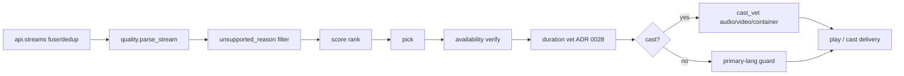

# Stream & audio selection — how nstream decides

Stream addons (built-in **Torrentio** when `torrentio_enabled`, plus any `cfg.addons`
manifests — Comet, MediaFusion, AIOStreams, …) return on the order of ~100+ streams per
title. Torrentio sorts by `qualitysize`, so the first is often the biggest/most extreme
file (8K upscale or a 60–100 GB Dolby Vision remux that an integrated GPU can't play).
Before ranking, `api.streams` drops unplayable shapes, fuses debrid `url` with pure-torrent
`infoHash` by filename across addons, and collapses duplicate releases (cached > url >
infoHash); each row carries `addon` provenance for labels/`--explain` (ADR 0024).

nstream then parses, filters and ranks the list to auto-pick the best playable one. This
document is the reference for _why_ a given file/audio is chosen.

```
nstream "<title>" --explain
nstream --json --explain --cast "<title>"
```

## End-to-end pipeline



Orchestrator: `stream_select.prepare_stream` (quality filter → rank/pick → resolve → guards).
Per-invocation `--quality` / `--audio-lang` hold across **every** reselect path (ADR 0021).

## Title discovery

Catalog and search results are deduplicated across configured addons. Search then applies a
local, token-free presentation ranking: exact normalized title matches first, then title
prefixes, substring matches, and finally the remaining addon results. Case, accents and
punctuation do not change the comparison; the original addon result remains the playback
source of truth.

**Headless year (ADR 0030):** an explicit `--year` is a hard constraint on title selection —
candidates whose catalog year is known and different are refused (`error: no_result` +
`years`). Titles without `releaseInfo` year are not refused this way.

The TUI stores recent queries and a metadata-only local watchlist in
`XDG_STATE_HOME/nstream/library.json`; no stream URL or provider token is persisted there.

### 1. Parse (`quality.parse_stream` → `StreamInfo`)

**Structured fields first, free text second (ADR 0026):**

| Field | Primary source | Fallback |
| ----- | -------------- | -------- |
| `release_name` | `behaviorHints.filename` | first line of `description`, then `title` |
| `size_gb` | `behaviorHints.videoSize` | regex on text corpus |
| `container` | filename extension | URL path |

Heuristic parsers (resolution, codec, HDR/DV, languages, source, audio, seeders, cached
marker) read a **union** text corpus: `name` + `description` + `title` + filename
(`quality._text`). `title` remains for Torrentio (deprecated in the protocol but still
populated). Cached markers (`[RD+]` / `[AD+]` / …) are provider-agnostic.

### 2. Filter (`unsupported_reason`, first match excludes)

Order: **hardware** (resolution cap → codec not HW-decodable → Dolby Vision P5) → **exact
quality** (`PlayOpts.quality`) → **cast audio** → **camrip** → **language** → **low seeders**.
Hardware checks always apply; the rest are opt-in config knobs (`allow_software` /
`allow_dv5` can flip a hardware exclusion back to playable).

The **cast audio** exclusion (TrueHD/DTS/DTS-HD, and remux, when casting) only applies when
Tier-2 remux is **off** (`cfg.cast_remux = false`). With remux on (default), those titles are
only *ranked* below native-AAC releases, not dropped (ADR 0005).

Language filter only excludes a stream **tagged exclusively with non-preferred languages**.
**Untagged streams are never excluded**.

### 3. Score (`quality.score_components` / `_score`, highest precedence first)

```
(cached, resolution, lang, source, hevc, seeders_bucketed, -size)
```

| term | meaning |
| ---- | ------- |
| `cached` | instant debrid stream ranks first |
| `resolution` | higher wins |
| `lang` | 2 = preferred (or multi), 1 = untagged, 0 = non-preferred only |
| `source` | remux(6) > bluray(5) > webdl(4) > unknown(3) > webrip(2) > hdtv/dvd(1) > camrip(0) |
| `hevc` | HEVC over H.264 at equal source |
| `seeders` | capped at 40 (`_SEED_BUCKET`) |
| `-size` | smaller among equals |

`cached` and `resolution` stay dominant (no surprising resolution downgrade for language).

**Cast score** (`cast=True`, models the Default Media Receiver, not the GPU):

```
(cached, remux_within_size, cast_audio, remux_within_cap, resolution, lang, source, cast_h264, seeders_bucketed, -size)
```

| term | meaning |
| ---- | ------- |
| `remux_within_size` | demote likely-remux releases above `cast_remux_max_size_gb` |
| `cast_audio` | 2 = DMR-native audio, 1 = untagged, 0 = Dolby/DTS (needs Tier-2) |
| `remux_within_cap` | prefer remux candidates ≤ `cast_remux_max_resolution` |
| `cast_h264` | weak tie-breaker (receiver also plays HEVC) |

After ranking, cast picks pass `cast_vet` (next section). **Mirror-over-remux (ADR 0015):**
when a remux would exceed `cast_mirror_over_remux_gb` (default 10) and the mirror sender is
available, `cast_flow` may switch to realtime mirror instead of downloading. `--mirror`
forces mirror; `--no-mirror` suppresses forced and auto paths for that run (ADR 0023).

### 4. Quality choice (before pick)

Per-session **exact resolution** filter (`PlayOpts.quality` / `--quality`):

| Value | Meaning |
| ----- | ------- |
| `None` | TUI shows picker; headless = no filter |
| `0` | Auto (no exact filter; binge sticky) |
| `720` / `1080` / `2160` / … | Hard-filter: only that `StreamInfo.resolution` |

Applied in `unsupported_reason` after the hardware `max_resolution` cap. Unknown resolution
(`0`) is excluded when the filter is active. Distinct from `max_resolution` (GPU ceiling).

Aliases: `auto`, `4k`/`uhd`/`2160`, `fhd`/`1080`, `hd`/`720`, `sd`/`480`. Headless failure:
`error: quality_unavailable` + `available_resolutions`. Binge sticky via `VettedStream.quality`.

### 5. Cap & pick (`stream_select._pick_stream`)

`auto` → `playable[0]`. Manual → fzf menu capped at `max_streams` with “show all”. With
`hw_filter` off, ranking is skipped (addon order), but an exact quality filter still subsets.

## Cast vetting (after pick)

`cast_vet` enforces what the Default Media Receiver can actually present. Ranking is a
preference; vetting is a **gate** (and may reselect).

| Gate | Function | ADR | Behaviour |
| ---- | -------- | --- | --------- |
| Audio plan | `vet_cast_audio` | 0005 | Prefer primary lang as first track; remux `0:a:N`; reselect dub; safety subs |
| Real video codec | `vet_cast_video` | 0017 | ffprobe codec; drop DivX/etc.; may yield `video_codec_unsupported` |
| Container | `vet_cast_container` | 0022 | mkv → MP4 rewrap when DMR needs it |

DMR plays the file’s **default** audio track and cannot switch embedded tracks. In-cast `a`
re-casts a different release. Details: [user/cast.md](user/cast.md).

## Availability: the cached marker is a guess (ADR 0014 + 0025)

`[RD+]`/`[TB+]` come from a crowdsourced database, not from the provider (Real-Debrid removed
its cache endpoint in 2024 — ADR 0002). Two guards, auto-pick only:

1. **Pre-commit verification** (`_verify_availability`): top 5 url-ready candidates probed
   concurrently (all of them, cached or not).
2. **Last-resort fallback** (`_ensure_playable`): re-check committed pick; P2P hybrid or next
   candidate.

Probe (`net.probe_url`) is **classified, not boolean**:

| Verdict | Signal | Effect |
| ------- | ------ | ------ |
| `live` | 2xx with plausible total size | keep |
| `gone` | 404/410/4xx | drop **and** denylist |
| `unknown` | incomplete size, 403/405/416, 5xx, timeout, transport | drop this run — **never** denylist |

Size mismatch never escalates to `gone` (in-flight `[RD download]` vs emptied file).

`gone` → `XDG_STATE_HOME/nstream/dead-sources.json` (TTL 30 days, 500 max) → `prune_dead`
pre-ranking. `nstream --forget-dead` clears. Headless `sources_removed` only when the denylist
accounts for **every** candidate; empty merely-not-ready set is `no_playable_stream`.

## Per-addon circuit breaker (ADR 0027)

Orthogonal to dead **sources**: Open addons are skipped in `api._gather` without paying
network (timeouts/retryable failures trip after 3 consecutive fails; 5 min cooldown then
Half-Open probe). State: `addon-breakers.json`. `nstream --forget-breakers` / `--explain`
lists Open addons.

## Content: reachable ≠ the video (ADR 0028)

Duration from ffprobe (`tracks.Tracks.duration`, memoized) vs expected runtime
(`api.expected_runtime_s`):

| Measured | Expected | Effect |
| -------- | -------- | ------ |
| `duration ≥ 0.35 × expected` | known (≥ 10 min) | keep (including longer) |
| `duration < 0.35 × expected` | known (≥ 10 min) | drop this run, never denylist |
| 0 (probe failed) | any | keep |
| any | unknown / &lt; 10 min | guard off |

Series expected runtime is the **series** meta typical episode length. Proven-short candidates
are removed from the working set so later reselects cannot land back on them. Headless:
`sources_truncated` + `duration_verified` on success.

## Subtitles (evidence tiers, ADR 0020)

Not a stream rank term, but part of “what you hear/see”:

| Tier | `subtitles_match` | When |
| ---- | ----------------- | ---- |
| Protocol hash | `hash` | OpenSubtitles moviehash of the exact file |
| Audio-anchored align | `audio` | Native engine on local/remux media; confidence-gated |
| Language guess | `lang` | Otherwise |

Config: `sub_align`, `sub_align_budget_s`. Manual `--sub-offset` / `--sub-fps` always win.
Cast path delivers WebVTT text tracks (ADR 0012).

## Config knobs

`hw_filter`, `max_resolution`, `allow_software`, `allow_dv5`, `lang_filter`, `audio_langs`,
`exclude_camrip`, `min_seeders`, `dedup`, `max_streams`, cast remux/mirror keys — full tables
in [user/config.md](user/config.md). Editable via `nstream --settings`.

Per-invocation quality is **not** a config default: use `--quality` or the TUI picker.

## Languages: one registry, one allow-list

All language knowledge lives in `languages.py` (`LANGUAGES`). `quality` and cast labels
derive maps from it. Selected languages = ordered allow-list `audio_langs` /
`subtitle_langs` — drives `--alang`/`--slang`, score `lang`, and soft `lang_filter`. No
separate hard view filter (would hide untagged releases that often carry wanted audio).

## Audio: stream language vs track language

`StreamInfo.languages` is a **heuristic** from the release name. Ground truth is ffprobe
ISO tags (and track titles when `und`).

- **Local (mpv):** inject `--alang=<audio_langs>` unless user set `alang`. Manual mode:
  `subs.choose_tracks` → `--aid`. Auto-play guard in `prepare_stream`: if no preferred track,
  warn / reopen menu (interactive) or play fallback with primary-language safety subs.
  Tags via `languages.normalize` (`it` ↔ `ita`). Missing probe never blocks; binge warns and
  continues.
- **Cast:** default track only; `a` re-casts another tagged release.

## Resolve & P2P privacy (ADR 0032)

Any path that joins a torrent swarm (primary resolve, cast `_playable_url` reselects, cached
fallback) must pass the P2P privacy gate when `p2p_require_vpn` is set — not a single call
site. Debrid-only URLs do not join the swarm.

## Deliberate trade-offs

- **`cached` dominates** language and resolution: instant playback is the top priority.
- **Untagged streams pass the language filter** but rank below tagged preferred-language ones.
- **Cast can't select tracks** → language switching is per-file, not per-track.
- **Structured metadata over prose** when the protocol provides it (ADR 0026).
