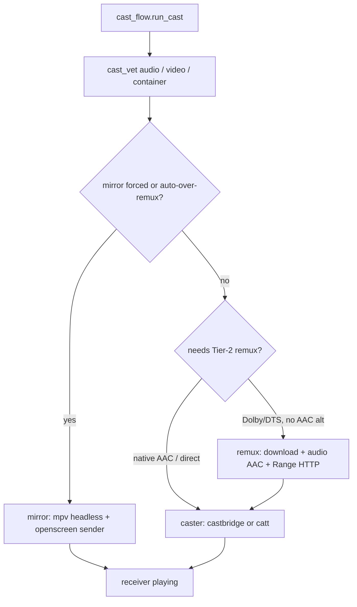

# Casting to Chromecast

nstream can send a title to a Chromecast instead of (or after) local mpv. Stream selection is
**cast-aware**: it ranks for the Default Media Receiver (DMR) profile, not the laptop GPU.
See [selection.md](../selection.md) for scoring and cast vetting.

## Prerequisites

| Component | Required? | Role |
| --------- | --------- | ---- |
| `catt` | Recommended | Discovery + fallback cast sender |
| **castbridge** (`$CASTBRIDGE_BIN`) | Optional | Preferred sender: metadata + event stream |
| **mirror sender** (`$CAST_MIRROR_BIN`) | Optional | Realtime 1080p SDR mirror |
| `ffmpeg` / `ffprobe` | Recommended | Track probe, Tier-2 remux, container rewrap |
| LAN reachability | Required | Host ↔ TV; Tier-2 needs inbound ports (below) |

Without castbridge, nstream falls back to `catt` (same cast, no now-playing metadata / rich
events). Without the mirror binary, `--mirror` / auto mirror-over-remux is unavailable.

## How to cast

| Action | How |
| ------ | --- |
| One-shot cast | `nstream --cast "title"` |
| Always cast | `prefer_cast: true` in config; override with `--local` |
| From TUI list | **Alt-C** on a title/episode/continue row (device picker if needed) |
| During local mpv | **Alt-C** moves current stream to the TV from the current position |
| Headless | `nstream --json --cast [--device NAME] "title"` — [headless.md](../headless.md) |
| Force mirror | `nstream --mirror "title"` or `cast_mode: "mirror"` |
| Suppress mirror | `--no-mirror` (also kills auto mirror-over-remux for that run) |

### Device resolution (ADR 0010)

Discovery never blocks the TUI: a background `catt scan` at startup fills a 24h disk cache
(`devices.json`). At cast time a cached device that passes a short reachability probe is used
immediately; otherwise nstream waits briefly on the pending scan (~6s; Ctrl-C → local mpv).
Casts target the device **IP** when needed (mDNS name flakiness). A saved `cast_device` is
honoured only if reachable. **No Chromecast on this network → local mpv fallback** with a
notice. Note: `catt scan -j` is broken in current catt; nstream parses text `catt scan`.

## Delivery backends

| Backend | Start | Fidelity | Cost |
| ------- | ----- | -------- | ---- |
| **Direct DMR** (castbridge/catt) | Instant stream | Full video (HEVC/4K/HDR) if codec ok | Needs DMR-decodable **audio** (AAC/…) |
| **Tier-2 remux** (ADR 0005) | Prepare wait (download whole file) | Video copy; audio → AAC | Disk + time; remux res capped by default |
| **Mirror** (ADR 0006/0015/0023) | Instant | 1080p SDR (HDR→SDR) | Needs openscreen sender + Hyprland/PipeWire |

### Tier-2 remux

DMR cannot decode AC-3/E-AC-3/DTS/TrueHD (silent TV). Selection **prefers AAC releases**;
when only Dolby/DTS exist and `cast_remux` is on, the host remuxes (video `-c copy`, audio to
`cast_audio_codec`). Caps:

- `cast_remux_max_resolution` (default 1080) — preference among remux candidates
- `cast_remux_max_size_gb` (default 20) — demote / confirm huge downloads
- `cast_mirror_over_remux_gb` (default 10) — auto-switch to mirror when remux would be large
  (ADR 0015), if the mirror binary is available

stderr shows a prepare message during remux. JSON field `reencoded: true` when remux was used.
`--stop` tears down the remux server and temp file; stale temps are GC'd on the next run.

### Firewall (Tier-2 only)

The TV **pulls** the remuxed file from the host (Range HTTP on ports **45000–47000**).
nstream never changes the firewall or invokes sudo during playback. On a connection
failure it prints guidance for an administrator to apply an appropriately scoped rule.
Direct casts and castbridge control are outbound-only.

## Cast-time vetting

After ranking, `cast_vet` enforces what the DMR can actually play:

| Gate | Module | Effect |
| ---- | ------ | ------ |
| Audio language + codec | `vet_cast_audio` | Prefer primary dub as first track; remux track select; safety subs |
| Real video codec | `vet_cast_video` (ADR 0017) | Drop DivX/etc.; may fail `video_codec_unsupported` |
| Container | `vet_cast_container` (ADR 0022) | mkv → MP4 rewrap when needed |

Audio on the DMR is **file default track only** — no embedded track switch. In-cast **`a`**
re-casts a **different release** tagged in the chosen language. Locally, mpv uses `#`.

## Subtitles on cast

External subs (when requested) go as a **WebVTT text track** on the castbridge path
(ADR 0012). Alignment tiers (hash / audio / lang): ADR 0020 and [headless.md](../headless.md).
`--sub-offset` / `--sub-fps` retime the file for both mpv and cast.

## Lifecycle & resume

| Command | Effect |
| ------- | ------ |
| `--json --status` | Receiver state, position, volume, `active_tracks`, `receiver_error` |
| `--json --stop` | Stop + persist position to history |
| `--json --pause` / `--resume` / `--seek SEC` / `--volume N` | Control in-progress cast |
| TUI home → 📺 In onda | Same controls without `--json` (pause, relative seek, volume, stop) |
| `--follow` | Hold until end; stream JSONL events (resume/auto-advance) |
| default headless cast | **Fire-and-return** (`--no-follow`); prefer `--stop` to close cleanly |

Continuation policy (who decides “next episode”): ADR 0029. Delivery must report started for
`ok: true`: ADR 0031.

## Config keys

See the **Cast** table in [config.md](config.md). Related ADRs: 0005–0008, 0010–0013,
0015–0017, 0022–0023, 0031.
