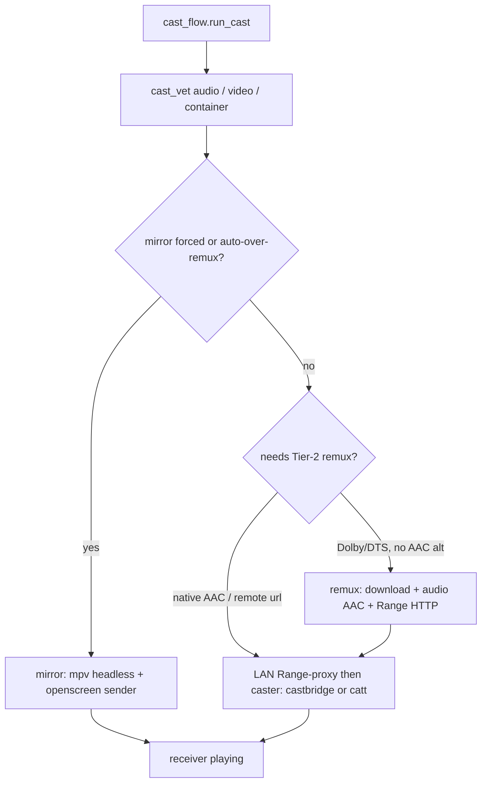

# Casting to Chromecast

nstream can send a title to a Chromecast instead of (or after) local mpv. Stream selection is
**cast-aware**: it ranks for the Default Media Receiver (DMR) profile, not the laptop GPU.
See [selection.md](../selection.md) for scoring and cast vetting.

## Prerequisites

| Component | Required? | Role |
| --------- | --------- | ---- |
| `catt` | Recommended | Discovery + fallback cast sender |
| **castbridge** (`$CASTBRIDGE_BIN`) | Optional | Preferred sender: metadata + event stream |
| **mirror sender** (`$CAST_MIRROR_BIN`) | Optional | Realtime 1080p SDR mirror |
| `ffmpeg` / `ffprobe` | Recommended | Track probe, Tier-2 remux, container rewrap |
| LAN reachability | Required | Host ↔ TV; Tier-2 needs inbound ports (below) |

Without castbridge, nstream falls back to **catt ≥0.13.2**. The **library** path
(`play_media_url`) sends title + Cinemeta/metahub HTTPS poster (`thumb` →
`metadata.images`) + `BUFFERED` in one LOAD (ADR 0050). The CLI fallback (`-l` /
`--stream-type`) has no `--thumb`. catt 0.13.0/0.13.1 keep the pre-0050 argv
(those builds reject `-l` and 0.13.1 can hang in `play_media_url`). Rich events
still need castbridge. Without the mirror binary, `--mirror` / auto
mirror-over-remux is unavailable.

A registered Custom Receiver is optional (`cast_receiver_app_id` in config). Empty keeps
Google's Default Media Receiver. The id is forwarded only when **castbridge** is the
sender (ADR 0013). catt has no arbitrary-app-id switch and always launches `CC1AD845`;
nstream emits `receiver_app_ignored` on that path (ADR 0045). An unpublished id only
launches on devices registered in the Cast Developer Console.

## How to cast

| Action | How |
| ------ | --- |
| One-shot cast | `nstream --cast "title"` |
| Always cast | `prefer_cast: true` in config; override with `--local` |
| From TUI list | **Alt-C** on a title/episode/continue row (device picker if needed) |
| During local mpv | **Alt-C** moves current stream to the TV from the current position |
| Headless | `nstream --json --cast [--device NAME] "title"` — [headless.md](../headless.md) |
| Force mirror | `nstream --mirror "title"` or `cast_mode: "mirror"` |
| Suppress mirror | `--no-mirror` (also kills auto mirror-over-remux for that run) |

### Device resolution (ADR 0010)

Discovery never blocks the TUI: a background `catt scan` at startup fills a 24h disk cache
(`devices.json`). At cast time a cached device that passes a short reachability probe is used
immediately; otherwise nstream waits briefly on the pending scan (~6s; Ctrl-C → local mpv).
Casts target the device **IP** when needed (mDNS name flakiness). A saved `cast_device` is
honoured only if reachable. **No Chromecast on this network → local mpv fallback** with a
notice. Note: `catt scan -j` is broken in current catt; nstream parses text `catt scan`.

## Delivery backends

| Backend | Start | Fidelity | Cost |
| ------- | ----- | -------- | ---- |
| **Direct DMR** (castbridge/catt) | Instant stream | Full video (HEVC/4K/HDR) if codec ok | Needs DMR-decodable **audio** (AAC/…) |
| **LAN Range-proxy** (ADR 0045) | Instant (same LOAD) | Native video; TV pulls the host | Default for a remote debrid url (`cast_lan_proxy`) |
| **Tier-2 live** (ADR 0039) | Seconds (live HLS-TS) | Video copy; audio → AAC stereo | ~40 min window on disk |
| **Tier-2 remux** (ADR 0005) | Prepare wait (download whole file) | Video copy; audio → AAC (multichannel) | Disk + time; fallback, or `cast_live: false` |
| **Mirror** (ADR 0006/0015/0023) | Instant | 1080p SDR (HDR→SDR) | Needs openscreen sender + Hyprland/PipeWire |

### Tier-2 remux

DMR cannot decode AC-3/E-AC-3/DTS/TrueHD (silent TV). Selection **prefers AAC releases**;
when only Dolby/DTS exist and `cast_remux` is on, the host remuxes (video `-c copy`, audio to
`cast_audio_codec`). Caps:

- `cast_remux_max_resolution` (default 1080) — preference among remux candidates
- `cast_remux_max_size_gb` (default 20) — demote / confirm huge downloads
- `cast_mirror_over_remux_gb` (default 10) — auto-switch to mirror when remux would be large
  (ADR 0015), if the mirror binary is available

With `cast_live` on (default) the conversion is streamed: the TV starts on the first
segments, in stereo AAC (5.1 AAC stalls the receiver over HLS). Headless `ok: true` on that
path requires the receiver to enter PLAYING/PAUSED/BUFFERING — a playlist GET is not a start
(ADR 0044). Dual-layer Dolby Vision (enhancement layer) and a first segment the DMR cannot
decode skip live. The complete-file remux is the fallback when the live start fails. JSON
`delivery` says which ran (`live` / `file`).

stderr shows a prepare message during remux. JSON field `reencoded: true` when remux was used.
`--stop` tears down the remux server and temp file; stale temps are GC'd on the next run.

### Remux / file metadata on the TV (ADR 0050)

A complete-file remux is a local `cast-*.mp4`. The same library LOAD is used for
a LAN Range-proxy, an hev1 rewrap, and a direct LAN URL. catt's CLI would
otherwise LOAD a remux stem as the title, leave `streamType` unset, and send
`metadataType` 0 with no artwork. nstream serves the bytes (Range HTTP) and
calls catt **≥0.13.2 library** `play_media_url` so one LOAD has the Cinemeta
title, the public Cinemeta/metahub HTTPS poster (`thumb` → `images[0].url`),
`contentType` (`video/mp4` on remux/file; the LAN mime on a proxy), and
`streamType: BUFFERED`. The poster is **not** rewritten onto the remux/LAN
host — the TV fetches Cinemeta/metahub itself. Other https hosts are not sent
as `thumb`. If `catt.api` cannot be imported, the CLI fallback still sends `-l`
+ `--stream-type BUFFERED` (no artwork). A library timeout or a session-wait
raise after the LOAD is **unconfirmed**: no second CLI LOAD (that would wipe
the poster). If the TV still has not confirmed our media after a short
grace poll, the cast is reported as not started
(`error: cast_never_started` / notice `cast_unconfirmed`) rather than
success. A leftover remux/LAN server is reaped after 15 minutes (or the
detached 3 h idle limit). In-cast `a` (audio switch) reuses the same
library/helper LOAD so title/artwork survive.

| LOAD field | catt library (preferred fallback) | catt CLI (import miss) | castbridge |
| --- | --- | --- | --- |
| `metadata.title` | Cinemeta title | `-l` | same (+ TvShow block) |
| `metadata.images` / poster | Cinemeta/metahub **https** `thumb` | **not sent** (no `--thumb`) | Cinemeta HTTPS poster |
| `metadataType` | 1 Movie / 2 TvShow (`media_info`) | GENERIC (0) | Movie / TvShow |
| `contentType` | `video/mp4` (remux); LAN mime on proxy | path guess | declared |
| `streamType` | `BUFFERED` | `BUFFERED` | BUFFERED (live HLS is another path) |

A custom receiver id is not required for DMR title+poster and is not launched on
catt (`receiver_app_ignored`, ADR 0013 / 0045). Do not treat a 720 H.264 remux as
the metadata fix.

`--json` is unchanged. `--status` already reports the receiver's `title`,
`content_type`, and `stream_type`.

### Firewall (Tier-2 only)

The TV **pulls** the remuxed file from the host (Range HTTP on ports **45000–47000**).
nstream never changes the firewall or invokes sudo during playback. On a connection
failure it prints guidance for an administrator to apply an appropriately scoped rule.
Direct casts that still hand the TV a remote URL are outbound-only. A LAN
Range-proxy (ADR 0045, default) needs the same inbound 45000–47000 rule as
Tier-2: the TV pulls the host, not the debrid WAN.

## Cast-time vetting

After ranking, `cast_vet` enforces what the DMR can actually play:

| Gate | Module | Effect |
| ---- | ------ | ------ |
| Audio language + codec | `vet_cast_audio` | Prefer primary dub as first track; remux track select; safety subs |
| Real video codec | `vet_cast_video` (ADR 0017, 0051) | Drop DivX/etc.; may fail `video_codec_unsupported`. Labels/`--json` use the probed codec when ffprobe already ran; otherwise `(claimed)` / `codec_source: release_name` |
| Container | `vet_cast_container` (ADR 0022) | mkv → MP4 rewrap when needed |

Audio on the DMR is **file default track only** — no embedded track switch. In-cast **`a`**
re-casts a **different release** tagged in the chosen language. Locally, mpv uses `#`.

## Subtitles on cast

External subs (when requested) go as a **WebVTT text track** on the castbridge path
(ADR 0012). Alignment tiers (hash / audio / lang): ADR 0020 and [headless.md](../headless.md).
`--sub-offset` / `--sub-fps` retime the file for both mpv and cast.

## Lifecycle & resume

| Command | Effect |
| ------- | ------ |
| `--json --status` | Receiver state, position, Cast volume 0–1 + `volume_percent`, `volume_control_type`, `volume_step_interval`, `app_id`, `content_type`, `stream_type`, `active_tracks`, `receiver_error` |
| `--json --stop` | Stop + persist position to history |
| `--json --pause` / `--resume` / `--seek SEC` / `--volume N` | Control in-progress cast |
| TUI home → 📺 In onda | Same controls without `--json` (pause, relative seek, volume, stop) |
| `--follow` | Hold until end; stream JSONL events (resume/auto-advance) |
| default headless cast | **Fire-and-return** (`--no-follow`); prefer `--stop` to close cleanly |

Continuation policy (who decides “next episode”): ADR 0029. Delivery must report started for
`ok: true`: ADR 0031.

## Config keys

See the **Cast** table in [config.md](config.md). Related ADRs: 0005–0008, 0010–0013,
0015–0017, 0022–0023, 0031, 0045, 0050.

`--volume N` / `catt volume N` is Cast percent (0–100 → `SET_VOLUME` 0–1). On
`volume_control_type: master` that is the device master, not a second stream fader.
The Philips 43PUS9235/12 DMR (app `CC1AD845`) reports `master` and
`volume_step_interval: null` at every Phase 0 grid point; catt integer % can
quantize (14→13). TV OSD ticks are a **different** scale — there is no
`osd_max` and no linear map (a remembered 14 ≈ OSD 8 / 0–60 guess was rejected).
Comfortable OSD ~12–15 means try Cast percents and read the TV, not a remapped
CLI. HEVC 1080 stutter on a **WAN-direct** catt cast (TV pulls a remote URL) is
a delivery path, not a codec miss. Default `cast_lan_proxy` Range-serves that
url from the host when the upstream honours Range (video pass-through,
`video/mp4`, real 206). No synthesized 206: an upstream without Range goes to
the existing remux / live tier. MKV still follows ADR 0022 (`cast_flow` `-c
copy` to MP4). This DMR already plays HEVC/4K/HDR from a LAN Range file or
live HLS. A 720 H.264 remux is triage, not the default. Missing `cast_sender`
only blocks the mirror fallback. JSON `delivery` is `lan` when the proxy ran.
Off (`cast_lan_proxy: false`) is debug only.
